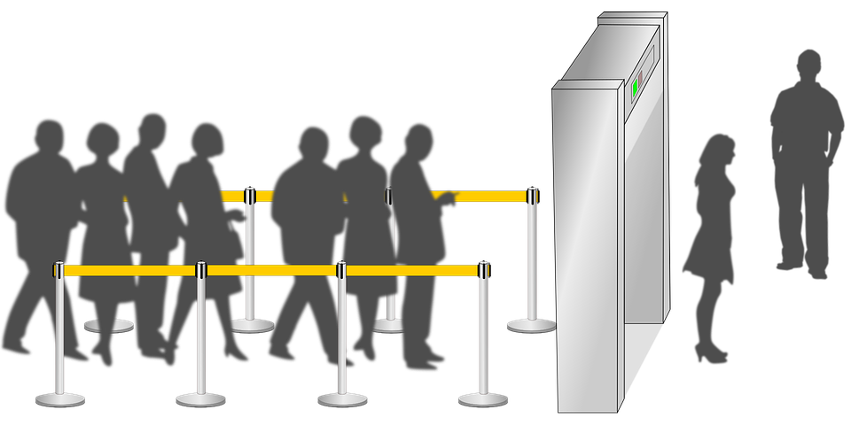

# Abstract Data Types (ADTs) - An Introduction

## What Are Abstract Data Types?

- An Abstract Data Type (ADT) is a way to describe:
  + data and 
  + the operations that can be performed on that data
  + without worrying about how those operations will be implemented.
- Think of it like a blueprint or a recipe. 
- You know what you want to build or cook, but you don't need to know every detail about how to do it.

## Why Are ADTs Important?

ADTs help programmers to:
1. **Organize Data**: They give a clear structure to how data is stored and accessed.
2. **Simplify Complexity**: By focusing on what operations can be performed rather than how they are done, it makes understanding and using the data easier.
3. **Improve Code Quality**: ADTs help in writing cleaner, more understandable, and maintainable code.

## Key Concepts

1. **Data**: The information that we want to store and manage.
2. **Operations**: The actions we can perform on the data, like adding, removing, or retrieving information.

## Common ADTs

Here are some common types of ADTs you will encounter:

1. **List**:
   - **Data**: A collection of items.
   - **Operations**: 
     + Add an item
     + remove an item 
     + find an item
     + get the item at a specific position.

2. **Stack**:
   - **Data**: A collection of items where the last item added is the first to be removed (LIFO - Last In, First Out).
   - **Operations**: 
     + Push (add an item)
     + Pop (remove the last item)
     + Peek (look at the last item without removing it).

3. **Queue**:
   - **Data**: A collection of items where the first item added is the first to be removed (FIFO - First In, First Out).
   - **Operations**: 
     + Enqueue (add an item)
     + Dequeue (remove the first item)
     + Front (look at the first item without removing it).

4. **Set**:
   - **Data**: A collection of unique items.
   - **Operations**:
     + Add an item
     + remove an item
     + check if an item exists.

5. **Map (or Dictionary)**:
   - **Data**: A collection of key-value pairs.
   - **Operations**:
     + Add a key-value pair
     + remove a key-value pair
     + find the value for a given key.

## Example: Stack ADT

Let's take a closer look at the **Stack** ADT to understand how it works.

Imagine you have a stack of books. You can only add or remove the book that is on the top of the stack. Here’s how you can think about the Stack ADT:

- **Push**: You place a new book on top of the stack.
- **Pop**: You remove the book from the top of the stack.
- **Peek**: You look at the book on the top of the stack without taking it off.

In a program, we don't care about how the stack is implemented. We just need to know that we can push, pop, and peek. This allows us to use the stack in our programs without worrying about the details.

## How to Use ADTs in Programming

1. **Define the ADT**: Decide what data and operations you need.
2. **Implement the ADT**: Write the code for the operations (this part is often done using classes or modules in programming languages).
3. **Use the ADT**: Use the operations provided by the ADT to manage your data in your programs.

## Summary

Abstract Data Types are essential tools in computer science that help us manage data in a structured and efficient way. By focusing on what operations we can perform on data rather than how they are implemented, ADTs simplify programming and help create better software.

Remember, ADTs are like blueprints. They tell us what we can do with our data, making it easier to write, understand, and maintain our code.

## Assignment
- Find how many ADTs are provided by Standard Template Library (STL) of c++ 
- Suppose you have 2 groups of friends,
  + Group 1: who want to go to pizza party, and
  + Group 2: who want to go for hiking,
  + Some interested in both pizza party and hiking
  + Which ADT will allow you to store the 2 group of students and perform operations such as finding out how many friends are interested in both pizza party and hiking?

- [DataFrame](https://pandas.pydata.org/docs/reference/frame.html) is frequently used in data science to store and manipulate data.
  + Look at the API and try to create a dataframe with atleast 10 rows.
  + Call `head`, `tail`, `iloc`,`mean`, `min`, `max`, and `info` methods on the dataframe. 