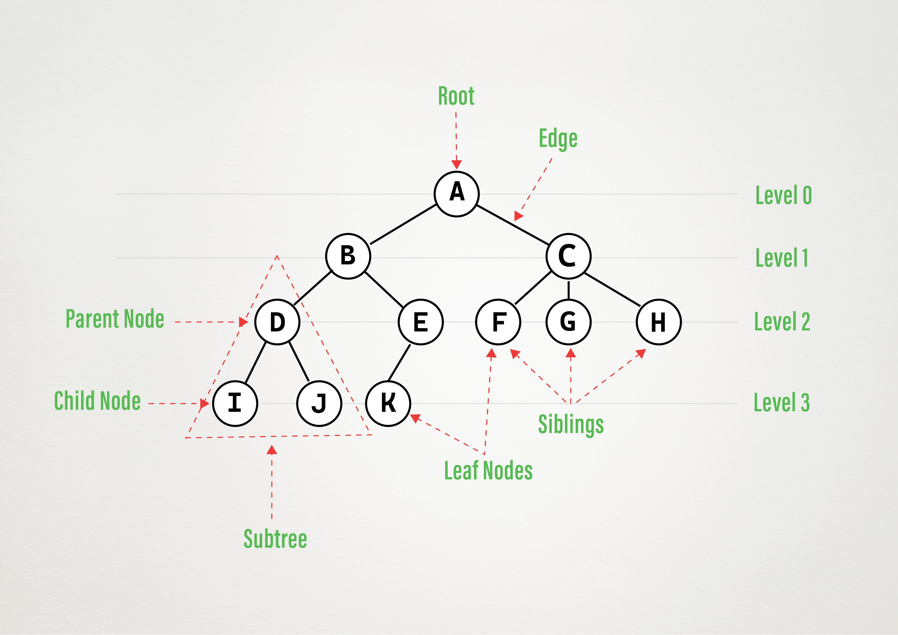

# Tree Data Structure
- A tree is a hierarchical data structure that consists of nodes connected by edges.
- It's a non-linear data structure, meaning the elements are not arranged in a sequential order.
- This structure allows for efficient representation and manipulation of data with hierarchical relationships. 

## Components of a Tree

* **Node:** A basic unit of a tree that contains data.
* **Edge:** A connection between two nodes.
* **Root:** The topmost node in a tree.
* **Parent:** A node that directly connects to another node below it.
* **Child:** A node that directly connects to another node above it.
* **Leaf:** A node with no children.
* **Subtree:** A portion of a tree that is itself a tree.

## Importance of Tree Data Structures
* **Hierarchical Representation:** Trees naturally represent hierarchical relationships like file systems, organizational structures, and decision trees.
* **Efficient Searching:** Binary Search Trees (BSTs) provide efficient searching and sorting algorithms.
* **Dynamic Structure:** Trees can easily grow and shrink, making them suitable for dynamic data.
* **Various Applications:** Trees are used in various fields, including computer science, database systems, and artificial intelligence.

## Real-World Examples
* **File Systems:** The directory structure of a file system is often represented as a tree.
* **Decision Trees:** Used in machine learning to make decisions based on a series of conditions.
* **Expression Trees:** Used to represent arithmetic expressions.
* **Game Trees:** Used in game AI to plan moves.

## Tree Traversal Algorithms

* **Preorder Traversal:** Visit the current node, then the left subtree, then the right subtree.
* **Inorder Traversal:** Visit the left subtree, then the current node, then the right subtree.
* **Postorder Traversal:** Visit the left subtree, then the right subtree, then the current node.

## Importance and Applications
* **Preorder:** Used for creating a copy of a tree, evaluating expressions, and printing a tree in prefix notation.
* **Inorder:** Used for printing a binary search tree in ascending order, evaluating arithmetic expressions, and generating infix notation.
* **Postorder:** Used for evaluating expressions in postfix notation, deleting a tree, and finding the height of a tree.

Each traversal algorithm has its own unique applications depending on the specific task at hand. Understanding these algorithms is essential for effectively working with tree data structures.

## C++ implementation 
[Traversal algorithms implemented in c++](../src/cprog/treetraversal.cpp)
## Visual Animation of Preorder Postorder and Inorder traversal
[dsvisualizer](https://dsvisualizer.isatvik.com/treetraversals)
## Classification of Various Types of Trees in Data Structures and Algorithms

| **Tree Type**                | **Description**                                                                                      | **Key Characteristics**                                                                                          | **Operations & Time Complexity**                                                                                   |
|------------------------------|------------------------------------------------------------------------------------------------------|-------------------------------------------------------------------------------------------------------------------|---------------------------------------------------------------------------------------------------------------------|
| **General Tree**             | A tree where each node can have any number of children.                                              | - No restrictions on the number of children per node.                                                             | - **Search:** O(n)   - **Insertion:** O(1) (if inserting as a child of a known node)   - **Deletion:** O(n)   |
| **Binary Tree**              | A tree where each node has at most two children.                                                     | - Each node has 0, 1, or 2 children (left and right).                                                             | - **Search:** O(n)   - **Insertion:** O(1) (if position is known)   - **Deletion:** O(n)                      |
| **Full Binary Tree**         | A binary tree where every node other than the leaves has exactly two children.                       | - All nodes have either 0 or 2 children.                                                                          | - **Search:** O(n)   - **Insertion:** O(1)   - **Deletion:** O(n)                                             |
| **Perfect Binary Tree**      | A binary tree where all internal nodes have two children and all leaves are at the same level.       | - Balanced structure with all leaf nodes at the same depth.                                                       | - **Search:** O(log n)   - **Insertion:** O(log n)   - **Deletion:** O(log n)                                 |
| **Complete Binary Tree**     | A binary tree where all levels are fully filled except possibly the last, which is filled from left to right. | - Leaves are as far left as possible.                                                                             | - **Search:** O(log n)   - **Insertion:** O(log n)   - **Deletion:** O(log n)                                 |
| **Degenerate Tree**          | A tree where each parent node has only one child, resembling a linked list.                          | - Can be either left-skewed or right-skewed.                                                                      | - **Search:** O(n)   - **Insertion:** O(n)   - **Deletion:** O(n)                                             |
| **Balanced Binary Tree**     | A binary tree where the height of the two subtrees of any node differ by at most one.                | - Ensures O(log n) time complexity for operations like insertion, deletion, and lookup.                           | - **Search:** O(log n)   - **Insertion:** O(log n)   - **Deletion:** O(log n)                                 |
| **Binary Search Tree (BST)** | A binary tree where for each node, the left child's value is less, and the right child's value is greater. | - Enables efficient searching, insertion, and deletion (O(log n) in average case).                                | - **Search:** O(log n) average, O(n) worst   - **Insertion:** O(log n) average, O(n) worst   - **Deletion:** O(log n) average, O(n) worst |
| **AVL Tree**                 | A self-balancing binary search tree where the difference in heights between left and right subtrees is at most one. | - Automatically balanced after every insertion and deletion.                                                      | - **Search:** O(log n)   - **Insertion:** O(log n)   - **Deletion:** O(log n)                                 |
| **Red-Black Tree**           | A self-balancing binary search tree where nodes are colored either red or black, ensuring balanced heights. | - Guarantees O(log n) time complexity for insertion, deletion, and search operations.                             | - **Search:** O(log n)   - **Insertion:** O(log n)   - **Deletion:** O(log n)                                 |
| **B-Tree**                   | A self-balancing search tree where nodes can have more than two children, commonly used in databases and file systems. | - Generalization of a binary search tree, with nodes having multiple keys and children.                          | - **Search:** O(log n)   - **Insertion:** O(log n)   - **Deletion:** O(log n)                                 |
| **B+ Tree**                  | A type of B-tree where all values are found in the leaf nodes and internal nodes only contain keys to guide the search. | - Commonly used in databases and file systems, ensuring that all records are at the leaf level.                   | - **Search:** O(log n)   - **Insertion:** O(log n)   - **Deletion:** O(log n)                                 |
| **Heap**                     | A complete binary tree that satisfies the heap property: in a max heap, each parent node is greater than or equal to its children, and in a min heap, each parent is less than or equal to its children. | - Used in priority queues and heap sort algorithm.                                                                | - **Search:** O(n)   - **Insertion:** O(log n)   - **Deletion:** O(log n)   - **Find Min/Max:** O(1)       |
| **Trie (Prefix Tree)**       | A tree used to store a dynamic set of strings, where keys are usually strings, and nodes represent prefixes of those strings. | - Used in autocomplete, spell-check, and IP routing. Efficient for search operations like exact match and prefix. | - **Search:** O(m)   - **Insertion:** O(m)   - **Deletion:** O(m)   (where m is the length of the key)     |
| **Suffix Tree**              | A compressed trie of all suffixes of a given string, used for pattern matching.                      | - Enables fast substring search, commonly used in text processing applications.                                   | - **Search:** O(m)   - **Insertion:** O(n)   - **Deletion:** O(n)   (where n is the length of the string)  |
| **Segment Tree**             | A tree used for storing intervals or segments and allows efficient querying of which of the stored segments overlap with a given point or interval. | - Commonly used in range query problems in competitive programming.                                               | - **Query:** O(log n)   - **Update:** O(log n)   (n is the number of elements in the array)                   |
| **Fenwick Tree (Binary Indexed Tree)** | A tree data structure that provides efficient methods for cumulative frequency tables.                      | - Used for dynamic cumulative frequency tables or performing range queries efficiently.                            | - **Query:** O(log n)   - **Update:** O(log n)   (n is the number of elements in the array)                   |

